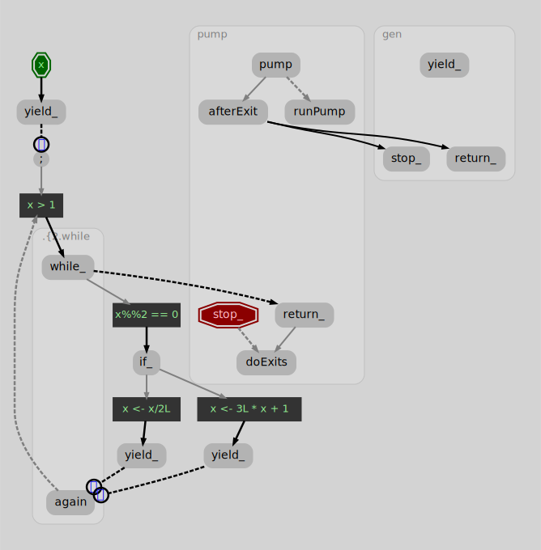

# The `async` package: Generators, async/await, and asynchronous streams for R

<p><a href="https://cran.r-project.org/package=async"></a><a href="https://github.com/crowding/async/actions/workflows/check-standard.yaml"></a> <a href="https://github.com/crowding/async/actions/workflows/test-coverage.yaml"></a></p>


This is an R package implementing *generators*, *async* blocks, and *streams* (collectively known as "coroutines.")

## New features in version 0.3

* Coroutines now support single step debugging. Use `debugAsync(obj, TRUE)` to pause before each call at R level. You can also use `debugAsync(obj, internal=TRUE)` to step through at the coroutine implementation level.
* Coroutines are printed with a label indicating where in their code they are paused.
* `switch` supports `goto()` to transfer to a different branch.
* Coroutines now support `on.exit()`.
* There is now syntax for generator functions: `gen(function(x, y) ...)` returns a function that constructs generators.
* `run(...)` will execute a generator expression immediately and collect the results in a list.
* There is now an experimental `stream()` coroutine backed by a `channel` class (asynchronous iterator).
* The underlying implementation now includes the back half of a compiler. As evidence of this, you can draw a graph of a coroutine's control structures by calling `graphAsync(gen)` (this requires you have Graphviz `dot` command installed on your system.)

[news]: https://github.com/crowding/async/blob/main/NEWS.md
For more details see [NEWS.md][news].

For more details on the package as a whole, see the [help index](https://crowding.github.io/async/reference/index.html) and [vignettes](https://crowding.github.io/async/articles/index.html). 

## Generators

`g <- gen({...})` is like a function that knows how to "pause." The
code in a generator runs until it hits a `yield()` call, then returns
that value. The next time you call the generator it picks up where it
left off and runs until the next `yield`.

[iterators]: https://CRAN.R-project.org/package=iterators

From the outside a generator implements the `iteror` interface.  You
extract each yielded value with `nextOr(g, or)`, and you can use
generators anywhere you can use an iteror. The `iteror` class is
cross compatible with the [iterators][] package.

### Example: Collatz sequence

Consider a sequence of numbers `x[i]`, starting with an arbitrary `x[1]`, where
each subsequent element is produced by applying the rule:

* If `x[i]` is even, then the next value will be `x[i+1] = x[i]/2`.
* if `x[i]` is odd,  the next value will be `x[i+1] = 3*x[i]+1`.

[conjectured]: https://en.wikipedia.org/wiki/Collatz_conjecture
An infinite sequence of numbers will continue form each staring point
`x[1]`, but it is [conjectured][] that all sequences will
eventually reach the loop 1, 4, 2, 1, 4, 2, .... The following
generator produces the Collatz sequence, starting from `x`, and
terminating when (or if?) the sequence reaches 1.


```r
library(async)
collatz <- gen(function(x) {
  yield(x)
  while (x > 1) {
    if (x %% 2 == 0)
      yield(x <- x / 2L)
    else yield(x <- 3L * x + 1)
  }
})
```

The call to `gen` produces a generator. You can get values one at a
time with `nextOr()`.


```r
ctz <- collatz(12)
nextOr(ctz, NA)
```

```
## [1] 12
```

```r
nextOr(ctz, NA)
```

```
## [1] 6
```

```r
nextOr(ctz, NA)
```

```
## [1] 3
```

```r
nextOr(ctz, NA)
```

```
## [1] 10
```

```r
nextOr(ctz, NA)
```

```
## [1] 5
```

You can also use any other method that applies to an iterator, like `as.list`.


```r
collatz(27L) |> as.list() |> as.numeric()
```

```
##   [1]   27   82   41  124   62   31   94   47  142   71  214  107  322  161  484
##  [16]  242  121  364  182   91  274  137  412  206  103  310  155  466  233  700
##  [31]  350  175  526  263  790  395 1186  593 1780  890  445 1336  668  334  167
##  [46]  502  251  754  377 1132  566  283  850  425 1276  638  319  958  479 1438
##  [61]  719 2158 1079 3238 1619 4858 2429 7288 3644 1822  911 2734 1367 4102 2051
##  [76] 6154 3077 9232 4616 2308 1154  577 1732  866  433 1300  650  325  976  488
##  [91]  244  122   61  184   92   46   23   70   35  106   53  160   80   40   20
## [106]   10    5   16    8    4    2    1
```

```r
#Try collatz(63728127L) |> as.list() |> as.numeric()...
```

[clapping]: https://crowding.github.io/async/articles/clapping.html
For more examples, see the ["Clapping Music" vignette.][clapping]

## Async/await

[promises]: https://rstudio.github.io/promises/ "promises"
Like `gen`, `async({...})` takes a block of sequential code, which
runs until it reaches a call to `await(p)`. The argument `p` should be
a promise, (as defined by the [promises]() package, which
represents an unfinished external computation.) In turn, `async()`
constructs and returns a promise.

An `async` block runs until it reaches a call to `await(p)` and
pauses.  When the promise `p` resolves, the `async` block continues.
If `p` rejects, that is evaluated like an error; you can use
`await(p)` into a `tryCatch` to handle rejections. When the `async`
block finishes, or throws an error, its promise resolves or rejects.

### Examples:

`async` doesn't handle running concurrent tasks by itself; it builds
on existing packages like `future` and `later`. The `later` package
lets you assign tasks to be done in the event loop, when R is idle.

Ring a bell 5 times at 10 second intervals (subject to R being idle):


```r
async({
  for (i in 1:5) {
    await(delay(10))     #delay() uses later::later()
    cat("Beep", i, "\n")
    beepr::beep(2)
  }
})
```

#### Shiny apps

[cranwhales]: https://github.com/crowding/cranwhales-await
`async()` can be used in Shiny apps! For an example, here is a version
of the ["Cranwhales" demo app using async/await.][cranwhales].

#### Background processing

`async` can also work with `future` objects to run computations in parallel.
Download, parse, and summarize a dataset in background processes like this:


```r
library(future)
library(dplyr)
plan(multiprocess(workers=2))

url <- "http://analytics.globalsuperhypermegamart.com/2020/March.csv.gz"
dest <- "March.csv.gz"

dataset <- async({
  if(!file.exists(dest)) {
    await(future({
      cat("Downloading\n")
      download.file(url, dest)
    }))
  }
  data <- await(future({
    cat("Parsing\n")
    read.csv(dest) |>
    mutate(time = hms::trunc_hms(time, 60*60)) |>
    group_by(time) |>
    summarize(sales=sum(amount))
  }))
})

# When the data is ready, plot it (in the main process:)
async({
  await(dataset) |>
  ggplot(aes(time, n)) +
    xlab("Time") +
    ylab("Sales")
})
```

## Streams

New in version 0.3 are asynchronous streams and channels. A channel is
an interface for asynchronous iteration; `stream()` lets you do things
with channels by writing code with `await` and `yield`. Here is an
example of channels being used to "walk and chew gum concurrently:"


```r
walk <- stream({
  for (i in 1:10)
    for (step in c("left", "right")) {
      yield(step)
      await(delay(0.5))
    }
})

chewGum <- stream(for (i in 1:12) {
  yield("chew")
  await(delay(0.8))
})

printEach <- async(function(st) {
  for (each in st) {cat(each, ", ", sep="")}
  cat("\n")
})

all <- combine(walk, chewGum) |> printEach()
```

```
## left, chew,
```

```
## right, chew, left, right, chew, left, chew, right, left, chew, right, chew, left, right, chew, left, right, chew, left, chew, right, left, chew, right, chew, left, right, chew, left, right,
```

## How does this work anyway?

A longer article will be forthcoming, but the basic gist is the `async` package transforms your given program into a state machine.

A coroutine expression is first scanned for uses of `await`, `yield`, `for`, `break` and other control flow calls. Those calls are swapped out for implementations local to the `async` package. Other R calls are wrapped in functions; all these functions are linked together in so that each function calls the next in sequence. The result is a graph of functions calling each other, each call corresponding to a step in the program.

As of `async` version 0.3 you can extract and visualize this graph with `graphAsync(g)`.


```r
ctz <- collatz(23)
graphAsync(ctz, type="svg") #creates a file "ctz.svg"
```



[continuation]: https://en.wikipedia.org/wiki/Continuation
Since each step in the program's execution corresponds to a function call, when execution reaches a `yield`, the program's state is just the "next function" that would have been called (that is, a [continuation][].) To pause and resume execution, a generator saves that "next function" until the next time  `nextOr()` is called.

You can also enable single-stepping at the graph level by calling:


```r
debugAsync(ctz, internal=TRUE)
```

```
## $R
## [1] FALSE
## 
## $internal
## [1] TRUE
```
