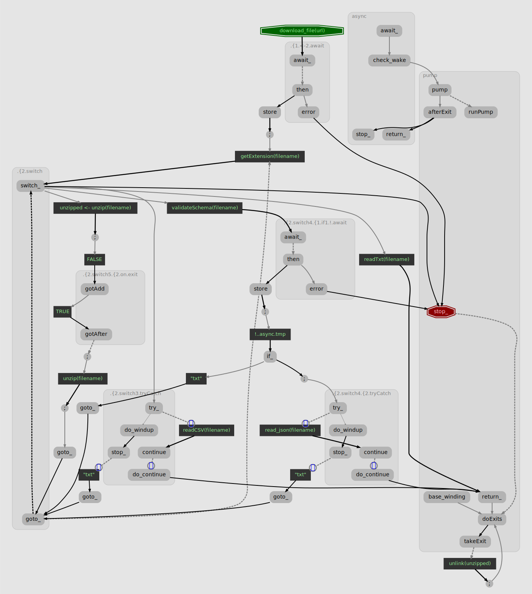

The `async` package allows you to write code that executes incrementally.

When an ordinary R function is called, control does not return until that function either produces a value, or finishes with an error. A `async({})` block. will run until it reaches an `await(pr)` and pauses, returning control until the value of promise `pr` is available. So a coroutine's evaluation can be temporally interleaved with other operations.

However, this does not require any changes to R's execution model; coroutines are implemented in terms of base R, within its single-threaded execution model. In order to pause and resume, a coroutine has to explicitly keep track of its internal state. When it reaches `yield` it saves its place, then resumes on the next `nextOr`.

In other words a generator is a kind of state machine sitting behind the `iteror` interface. An `async` also operates as a kind of state machine, one that interacts with the`promise` interface; its state advances according to its program and how awaited promises and other calls resolve.

The particular state transitions, and the internal state that is tracked, are constructed from the coroutine expression. In other words you could say that the `async` package implements a mini-language for describing state machines.

The illusion that a coroutine works like a parallel stream of R code is due to this mini-language being constructed to function analogously to base R. However, the language is _slightly_ different from base R, so this document tries to collect and explain those differences, and tries to paint a picture of how these objects operate.

### Basics: Pausable functions

The first thing to know about the coroutine mini-language is that a `yield()` or `await()` can only appear under the arguments of "pausable" functions.  The `async` package has built in pausable implementations of R's most commonly used control flow and error handling functions. The function `async::pausables()` will return a list of all pausable functions it can see. As of this writing, the list is:

```{R}
library(async)
pausables() |> vapply(as.character, "") |> sort()
```

While any R functions can be used in a coroutine expression, `yield` or `await` can only appear within the arguments of the above functions. This restriction applies recursively; the following is illegal because `list` is not pausable.

```{R, error=TRUE}
L <- run( list( if (x) yield(y) else yield(x) ) )
```

The error message refers to option `split_pipes`, which offers a workaround. If `split_pipes=TRUE`, an await in the leftmost argument of a function can be rewritten using a temp variable. `async({await(x) + 5})` will be rewritten using the "base R pipe" i.e. `async({await(x) ->.; . + 5})`

### Coroutines vs. functions

Constructing a `gen` or `async` is somewhat like calling a _function_, in that it creates a new environment, executes a given block of code with respect to that environment, and supports actions like `break`, `return`, `stop`, and `on,exit`. that apply to a scope. Coroutine constructors by themselves do not take arguments; to create a generator with respect to some argument, you simply write a function that takes and argument and returns a generator:

```{R}
# given a sequence of sequences, concatenate them like c() into one sequence
chain <- function(sequences) {
  force(sequences)
  gen({
    for (seq in sequences) {
      yieldFrom(seq)
    }
  })
}
```

Note that it is a good practice in R to `force()` the function arguments, as in any case when a function returns an inner construct that captures its scope. Because it's easy to forget to force arguments, the `async` package offers a "generator function" syntax. So the above can be rewritten as:

```{R}
chain <- gen(function(sequences) {
  for(seq in sequences) {
    yieldFrom(seq)
  }
})
```

All that is going on here is when `gen` sees `function` as the head of its expression, it just adds the `force` and moves the call to "gen" inside the function, reproducing the earlier version..

### Functions in coroutines

Coroutines do not have a stack or a notion of procedure calls; function definition is left to R, and the coroutine parser will ignore anything written in a function definition. If you write an inner function in a generator, that inner function will not be able to `yield`.

```{R, error=TRUE}
names <- c("Ana", "Bob", "Charlie")
g <- gen({
  greet <- function(name) yield(paste0("Good morning, ", name))
  for (i in names) {
    greet(name)
  }
})
as.list(g)
```

However, you can use `yieldFrom()` to return any number of values from another iterator.

```{R}
names <- c("Ana", "Bob", "Charlie")
greet <- gen(function(name) {
  yield(paste0("Good morning, ", name))
})
run(type="", {
  for (n in names) {
    yieldFrom(greet(n))
  }
})
```

### Loops

 `for` loops in a coroutine can run over iterators as well as plain vectors. The `in` argument to a `for` loop will be converted to the `iteror` interface using `iteror(x)`.

When writing an `async` or `stream` routine, `for` loops can be used to consume values from channels/streams, without explicitly calling `await()`.

`repeat`, `while` and `for` otherwise work like in base R, including support for `next` and `break` operators.

You can also write looping code by using `switch()` with `goto()`, described below.

### Conditionals and branches

#### Logical branching: `if`, `||` `&&`

 Coroutine `if` statements work similarly to base R.

Short circuiting logical operators `||` and `&&` will try first their left branch, which must return a scalar logical. If not satisfied with the left branch, they will evaluate the right argument and return it directly. That is, in a coroutine `yield(TRUE) && "string"` may return "string", while in base R this raises an error.

I write "may" above, because if you write `||` in a coroutine expression you might be using either base R `||` or the pausable version of `||`. In general you will only be using pausable `||` if there is a pause somewhere on either side of it. So if you write `(x == 5) || FALSE` you will be using base R `||`, since `==` does not pause.  Whereas if you write `(await(success) == 5) || yield("assertion")` you will be using pausable `||`, because there is an `await` on one side of it.

#### `switch` and `goto`

`switch()` statements are more strict than in base R; the input to a `switch` _must_ match a given branch or it will raise an error. That is, in base R, `switch(-1, "not run")` or `switch("bar", foo="not run")` returns invisible `NULL`, while in a coroutine this is an error.

Additionally, `switch` statements support a _delimited goto_. Within a given `switch` statement, `goto("other_branch")` stops executing the present branch and jumps to the given sibling branch. Calling `goto()` without arguments re-reads the switch input again. For example, you might try to read an input file that might be in a few different formats.

```{R, echo=FALSE}
download_file <- function(url) async:::mock_promise()
```
```{R}
file_dataset <- async({
  filename <- await( download_file(url) )
  switch(getExtension(filename),
      "txt"=readTxt(filename),
      "csv"=tryCatch(readCSV(filename), error=goto("txt")),
      "json"={
          if (!await(validateSchema(filename))) goto("txt")
          tryCatch(read_json(filename), error=goto("txt"))
      },
      "zip"= {
          unzipped <- unzip(filename)
          on.exit(unlink(unzipped))
          unzip(filename)
          goto() # i.e. run getExtension on the new filename
      }
  )
})
```

Here, if there is an error in reading a `.csv` or `.json` file we re-try ingesting it as a text file; on encountering a `zip` file we unzip it and try again with the new filename. If a  `goto` appears inside of a `try(..., finally={...})` call, which is itself inside a branch, the `finally` clause will be executed _before_ jumping to the new branch.

### What's under the hood? Coroutines are state machines, which are graphs

All of this sequencing we are discussing through this document is baked into a sort of graph structure when a generator is constructed. See if you can follow the logic of the preceding `async` through its graph:

```{R}
graphAsync(file_dataset, type="svg")
```
{width=100%}

Is it a bit spaghetti? Here we have nodes for each discrete step in the computation. Nodes in reverse type are user-level R calls, there are a few grouped nodes to handle an `await` or `tryCatch`.

Each node in the graph is literally a function and each line represents where it calls the next function. You can step through these if you set `debugAsync(as, debugInternal=TRUE)`.

Saving state, then, is just remembering the last call. (Dotted lines, here, represent where it saves state rather 

### Starting, pausing, finishing, errors, and cleanup

Starting and finishing may mean different things for different coroutines.

#### Starting
* `run` is "eager;" executes an entire coroutine expression immediately without pausing.
* Generators are "lazy;" at the start, a `gen` does not compute anything when it is first constructed, it only begins executing when there is a request for data via `nextOr`.
* `async` routines are "eager;" they begin executing immediately on creation, before the constructor returns. An `async` runs until it gets the first `await` and then pauses. allowing the constructor to return. Upon receiving, the async will continue running.
* `stream` objects can run in either lazy or eager mode. If `lazy=TRUE`, they will not compute anything until something calls the channel's [nextThen](), and will pause after `yield` if there are no more listeners.  If `lazy=FALSE`, a stream starts executing when constructed, will not pause after `yield`, and may run ahead and queue up outgoing values until it reaches an `await`.

#### Pausing
 * `await(p)` in an `async` or stream, pauses execution until the given promise resolves.
 * `yield(val)` in a generator pauses execution, returns the given value as the result of `nextOr()`.
 * `yield(val)` in a stream, resolves the next listener with the value given. It may or may not pause depending on whether `lazy=TRUE` and whether there are any more pending requests/
 * `yieldFrom(i)` takes an iterator _or_ a stream as argument, and yields successive values until it is exhausted. `yieldFrom(iter)` is basically equivalent to `for (i in iter) yield(i)`.

#### Finishing
A coroutine might finish normally by reaching a call to `return(...)`, or by simply reaching the end of its expression.

If a coroutine reaches a `return` call, all enclosing `tryCatch(finally=)` and `on.exit` handlers will be executed before returning the value.

* When a generator finishes normally, the present call [`nextOr`()] forces its `or` argument. The value returned by the generator expression is discarded.
* When an `async` finishes normally , its promise interface resolves with the return value.
* When a stream finishes normally, the listeners will be notified of a close _after_ any remaining messages have been read from the channel's outgoing queue.

#### Errors
A coroutine might finish abnormally if the user-level R code throws an error, or if there is an internal error in the coroutine implementation.

* When a `gen` or `run` routine finishes abnormally, all `on.exit` clauses are triggered, while the inciting error is allowed to propagate normally without being caught.
* If a `async` routine throws an error, it will be caught and the error will be forwarded to reject a promise.

#### Cleanup
`on.exit` handlers are run in a special phase after main execution finishes (either normally or abnormally). After `on.exit` handlers have all finished, the coroutine will continue to propagate its error or its return value.

If you were to do something as strange as `return()` or `yield()` from an on.exit handler, any pending error will be cancelled. (This is also how base R's `on.exit` behaves.)

### Exception handling

Errors during execution can come from user-level R code, or, possibly, from within the coroutine implementation itself. The coroutine implementation of `tryCatch` tries to be able to catch either type. When a coroutine enters a `tryCatch`, it briefly saves state so that it can wind up an R-level `tryCatch` and continuing underneath it. This way it can catch exceptions coming from both the coroutine implementation and user-level R calls.

A slight difference from base R `tryCatch` is you can supply a non- function value to `error` if you don't care about parsing the error message; it will just return that value.

```{R, echo=FALSE}
with_timeout <- function(...)async:::mock_promise()
```
```{R}
  as <- async({
    tryCatch(
      await(with_timeout(x, 10)),
      error=return("Value was not available"))
  })
```

For that matter, you can provide an error value or handler directly to `await`, and this might be more efficient as it doesn't have to wind up another tryCatch on the coroutine end of things.

```{R}
as <- async({
  await(with_timeout(promise()),
        "Value was not available")
})
```

You can also use `break` or `next` or `goto` in the `error` value to take those actions on error. 

### Cleaning up

#### Cleanup via on.exit
A coroutine may have a list of exit handlers. The `expr` argument to each `on.exit` is pulled out at parse time to make each handler; so that their effective scope is outside of any enclosing loops or tryCatch calls.

At run time, calling `on.exit`registers the given handler to be executed later.. When the coroutine finishes, either by normal return or by error, the coroutine saves the return value and starts executing each handler that was registered. After the last `on.exit` handler has been executed, the saved value is returned.

A typical use of `on.exit` might be to close a file or other resource after you are done reading; here's a simple generator that reads a file one line at a time:

```{R}
fileLines <- gen(function(...) {
  f <- file(..., open="rt")
  on.exit(close(f))
  while (length(line <- readLines(f, 1)) > 0) yield(line)
})
length(as.list(fileLines("language.Rmd")))
```

It is possible (but rather strange) to call `stop()` or `return()` from inside an `on.exit` handler. In that case the new value and disposition overrides the old one.

```{R, error=TRUE}
x <- run({
    on.exit({return("this instead")})
    stop("an error")
})
x
```

Here he have an odd situation where an error is printed out to the console, but the value was returned from `run` anyway. (Base R also does this.)

#### Cleanup with try/finally

`tryCatch(expr={...}, finally={...})` will execute `expr`, and after `expr` finishes,  whether it finishes normally or not, `tryCatch` will then execute `finally`. 

The `finally` clause will also be executed if you exit from `expr` _without_ finishing it, for instance by `break` or `next` in a loop, or by `goto` in a switch statement.

Assuming `finally` finishes normally, `tryCatch` will either return the saved return value or throw the saved error from `expr`. If the `finally` clause throws an error then the original error will be lost.

#### A caveat about cleanup
Writing code in a coroutine's `on.exit` clause or in a `tryCatch(finally=)` call does not give any guarantee that the cleanup code will ever run, because coroutines only execute "on demand." If you make a generator designed to return ten items, then call `nextOr` ten times, the generator will never run its exit handler. The generator will just be paused waiting to reach end of iteration; you need to call `nextOr` an _eleventh_ time to allow it to reach the end, run ts exit handlers and signal end of iteration.

```{R}
finished <- FALSE
g <- gen({
  on.exit(finished <<- TRUE)
  for (i in 1:10) yield(i)
})
for (j in 1:10) nextOr(g, break)
finished
nextOr(g, "stop")
finished
```

Similarly, an `async` with an `on.exit` or `finally` handler will not exevute those handlers if it is paused on an `await` that never resolves. With those caveats in mind, coroutines do implement both `on.exit` and `finally` constructs and they are useful for sequencing cleanup actions.

#### `tryCatch` and iteration performance
When a coroutine enters a `tryCatch` it has to momentarily save state
so that it can wind up an R-level `tryCatch` on the stack and then
resume. If there is a a `yield` or `await` in the tryCatch expression,
the coroutine has to exit from its tryCatch and re-establish it when execution resumes.

This means that yielding from inside a tryCatch can be more costly, performance-wise, than a regular yield. This is part of what motivated the development of the [iteror] class; desiring a protocol for iteration that did not involve using exceptions for normal flow control.

For instance compare the performance of iterating over an `iterator::iter` versus an [iteror].

```{R}
bench <- microbenchmark::microbenchmark(
  as.list(gen(for (i in iterators::iter(1:1000)) yield(i))),
  as.list(gen(for (i in iteror(1:1000)) yield(i))),
  times=10
)
summary(bench)[, c("expr", "median")]
```

Part of the difference comes from the fact that `gen` must use a `tryCatch` for each time to calls `nextElem` on an `iterator`. Whereas calling `nextOr` on an `iteror` does not involve many calls to `tryCatch`.

### Debugging

`generators` and `run` try to operate without using any `tryCatch` handlers. This means that if a generator encounters a problem, the error will bubble up through R's normal error handling mechanism, and it should be relatively easy to use `options(error=recover)` to debug the error.

`async` and `stream` are required to have a global `tryCatch` because any errors they encounter should be forwarded to listeners. This however makes it a bit harder to debug them.

The method `debugAsync()` will toggle single step debugging on a coroutine.

If you call `debugAsync(co, R=TRUE)` the coroutine `co` will start a  browser before executing each user-level R expression. You can press "n" to step through each expression.

If you call `debugAsync(co, internal=TRUE)` the browser will be opened at the R implementation level. This will present you with a twisty little path of tailcalls; Step through each call with `n` but make sure to `s` to step into a tailcall to follow execution.

[nseval]: https://github.com/crowding/nseval
The `async` package imports [nseval]() which I find can be very handy at the debugger console. I often use `get_function()`, `get_call()`, ans `caller()` to get a handle on where exactly the debugger is paused at.  `arg_env` `arg_expr`, `is_forced` and friends really help when ng with R's lazy evaluation,
